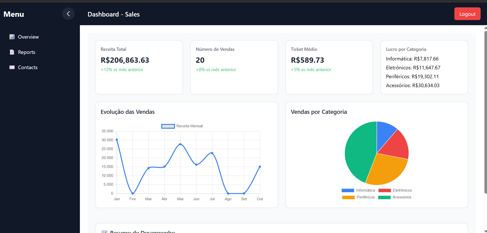
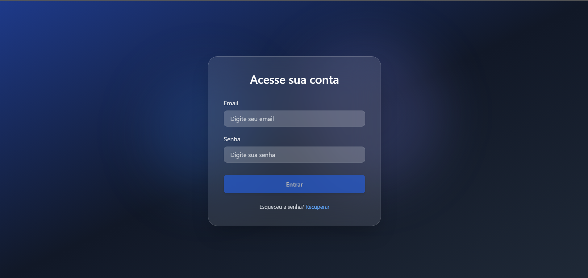
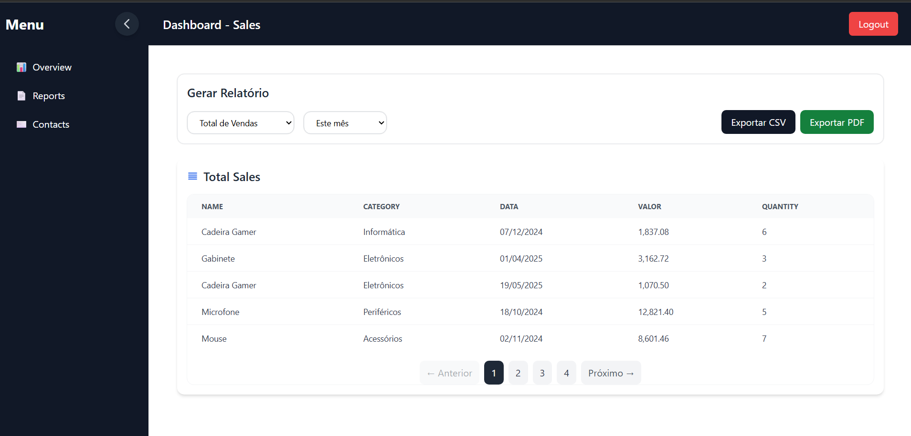
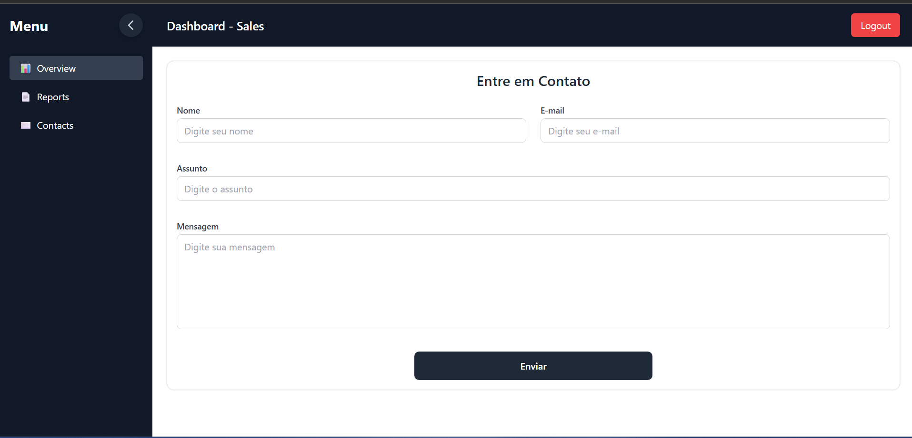

# 📊 Dashboard Sales


Um dashboard moderno e responsivo para análise de vendas, desenvolvido com Angular 18, Tailwind CSS, Chart.js e Supabase. A aplicação oferece visualizações interativas de dados de vendas, relatórios detalhados e insights de negócio, com autenticação segura e banco de dados em tempo real.

## ✨ Funcionalidades

### 🏠 Overview Principal

- **Total de Vendas**: Visualização do faturamento total
- **Ticket Médio**: Análise do valor médio por venda
- **Crescimento Mensal**: Gráficos de evolução das vendas
- **Lucro por Categoria**: Análise de rentabilidade por segmento

### 📈 Relatórios e Insights

- Relatórios detalhados com filtros avançados
- Exportação de dados em PDF usando jsPDF
- Visualizações interativas com Chart.js
- Análise de tendências e padrões de vendas

### 🔐 Autenticação

- Sistema de login seguro com Supabase Auth
- Controle de acesso às funcionalidades
- Gerenciamento de sessão do usuário em tempo real
- Autenticação persistente e auto-refresh de tokens

### 📱 Interface Responsiva

- Design moderno com Tailwind CSS
- Sidebar colapsível para dispositivos móveis
- Layout adaptativo para diferentes telas

## 🛠 Tecnologias Utilizadas

### Frontend

- **Angular 18** - Framework principal
- **TypeScript 5.5** - Linguagem de programação
- **Tailwind CSS 3.4** - Framework de estilos
- **Chart.js 4.5** - Biblioteca de gráficos
- **RxJS 7.8** - Programação reativa
- **Supabase 2.75** - Backend-as-a-Service

### Ferramentas de Desenvolvimento

- **Angular CLI 18** - Ferramentas de linha de comando
- **Karma + Jasmine** - Framework de testes
- **PostCSS** - Processamento de CSS
- **Autoprefixer** - Compatibilidade de CSS

### Backend e Banco de Dados

- **Supabase** - Backend completo com PostgreSQL
- **Supabase Auth** - Sistema de autenticação
- **Real-time subscriptions** - Atualizações em tempo real
- **Row Level Security** - Segurança a nível de linha
- **APIs REST automáticas** - Endpoints gerados automaticamente

### Bibliotecas Externas

- **jsPDF 3.0** - Geração de PDFs

## 🗂 Estrutura do Projeto

```
dashboard-sales/
├── src/
│   ├── app/
│   │   ├── modules/                    # Módulos por funcionalidade
│   │   │   ├── auth/                   # Autenticação
│   │   │   │   └── login/             # Componente de login
│   │   │   ├── overview/              # Overview principal
│   │   │   ├── reports/               # Relatórios
│   │   │   ├── contact/               # Contato
│   │   │   └── layout/                # Layout principal
│   │   ├── services/                  # Serviços Angular
│   │   │   ├── auth.service.ts        # Serviço de autenticação
│   │   │   ├── sales.service.ts       # Serviço de vendas
│   │   │   └── supabase.service.ts    # Serviço Supabase
│   │   ├── types/                     # Interfaces TypeScript
│   │   │   ├── sales.interface.ts     # Interface de vendas
│   │   │   ├── reports.interface.ts   # Interface de relatórios
│   │   │   └── login.interface.ts     # Interface de login
│   │   ├── app.routes.ts              # Configuração de rotas
│   │   └── app.config.ts              # Configuração da aplicação
│   ├── components/                     # Componentes compartilhados
│   │   └── sidebar/                   # Sidebar de navegação
│   ├── environments/                  # Configurações de ambiente
│   │   ├── environment.ts             # Ambiente de produção
│   │   └── environment.development.ts # Ambiente de desenvolvimento
│   └── styles.css                     # Estilos globais
├── package.json                       # Dependências do projeto
├── tailwind.config.ts                 # Configuração do Tailwind
└── angular.json                       # Configuração do Angular
```

## 🚀 Como Executar o Projeto

### Pré-requisitos

- **Node.js** v18 ou superior
- **npm** v9 ou superior
- **Angular CLI** v18

### Instalação

1. **Clone o repositório:**

```bash
git clone https://github.com/seu-usuario/dashboard-sales.git
cd dashboard-sales
```

2. **Instale as dependências:**

```bash
npm install
```

3. **Execute o projeto:**

```bash
npm start
# ou
ng serve
```

4. **Acesse a aplicação:**

```
http://localhost:4200
```

### Scripts Disponíveis

```bash
# Desenvolvimento
npm start              # Inicia o servidor de desenvolvimento
npm run build          # Compila o projeto para produção
npm run watch          # Compila em modo watch
npm test              # Executa os testes unitários
```

## 📊 Backend e Dados

O projeto utiliza Supabase como backend completo:

- **Supabase PostgreSQL**: Banco de dados principal
- **Supabase Auth**: Sistema de autenticação
- **Real-time subscriptions**: Atualizações em tempo real
- **Row Level Security**: Segurança a nível de linha
- **APIs REST automáticas**: Endpoints gerados automaticamente

### Estrutura de Dados

```typescript
interface Sale {
  id: number;
  product: string;
  category: string;
  quantity: number;
  price: number;
  date: string;
  cost?: number;
}
```

## 🎨 Funcionalidades Detalhadas

### Overview

- **Métricas em Tempo Real**: Total de vendas, ticket médio, crescimento mensal
- **Gráficos Interativos**: Visualizações com Chart.js
- **Categorização**: Análise por categoria de produtos
- **Filtros Temporais**: Análise por período
- **Dados Dinâmicos**: Atualizações em tempo real via Supabase

### Relatórios

- **Exportação PDF**: Geração de relatórios em PDF
- **Filtros Avançados**: Busca por categoria, período, valor
- **Visualizações**: Gráficos de barras, linhas e pizza

### Autenticação

- **Login Seguro**: Sistema de autenticação com Supabase Auth
- **Controle de Sessão**: Gerenciamento de usuário logado em tempo real
- **Proteção de Rotas**: Acesso controlado às funcionalidades
- **Persistência de Sessão**: Login mantido entre sessões
- **Auto-refresh de Tokens**: Renovação automática de tokens de acesso

## 🔧 Configuração do Tailwind CSS

O projeto está configurado com Tailwind CSS para estilização:

```typescript
// tailwind.config.ts
export default {
  content: ["./src/**/*.{html,ts}"],
  theme: {
    extend: {},
  },
  plugins: [],
};
```

## 📱 Responsividade

- **Mobile First**: Design otimizado para dispositivos móveis
- **Sidebar Colapsível**: Menu lateral responsivo
- **Grid Adaptativo**: Layout que se adapta a diferentes telas
- **Touch Friendly**: Interface otimizada para toque

## 🧪 Testes

```bash
# Executar testes unitários
npm test

# Executar testes com coverage
npm run test:coverage
```

## 📦 Build para Produção

```bash
# Compilar para produção
npm run build

# Arquivos serão gerados em dist/dashboard-sales/
```

## 🤝 Contribuição

1. Fork o projeto
2. Crie uma branch para sua feature (`git checkout -b feature/AmazingFeature`)
3. Commit suas mudanças (`git commit -m 'Add some AmazingFeature'`)
4. Push para a branch (`git push origin feature/AmazingFeature`)
5. Abra um Pull Request

## 📄 Licença

Este projeto está sob a licença MIT. Veja o arquivo `LICENSE` para mais detalhes.

## 📞 Contato

- **Email**: jeangomes1567@gmail.com
- **LinkedIn**: (https://www.linkedin.com/in/jean-gomes-035297193/)
- **GitHub**: (https://github.com/JeanGomes01)
- **Portfolio**: (https://github.com/JeanGomes01)

## 🎨 UI/UX

Interface e experiência do usuário desenvolvidas com foco na usabilidade e design moderno.

|            Overview Principal            |           Tela de Login            |
| :---------------------------------------: | :--------------------------------: |
|  |  |

|              Tela de Relatórios              |
| :------------------------------------------: |
|  |

|             Tela de Contatos             |
| :--------------------------------------: |
|  |

---

⭐ **Se este projeto foi útil, considere dar uma estrela!**
